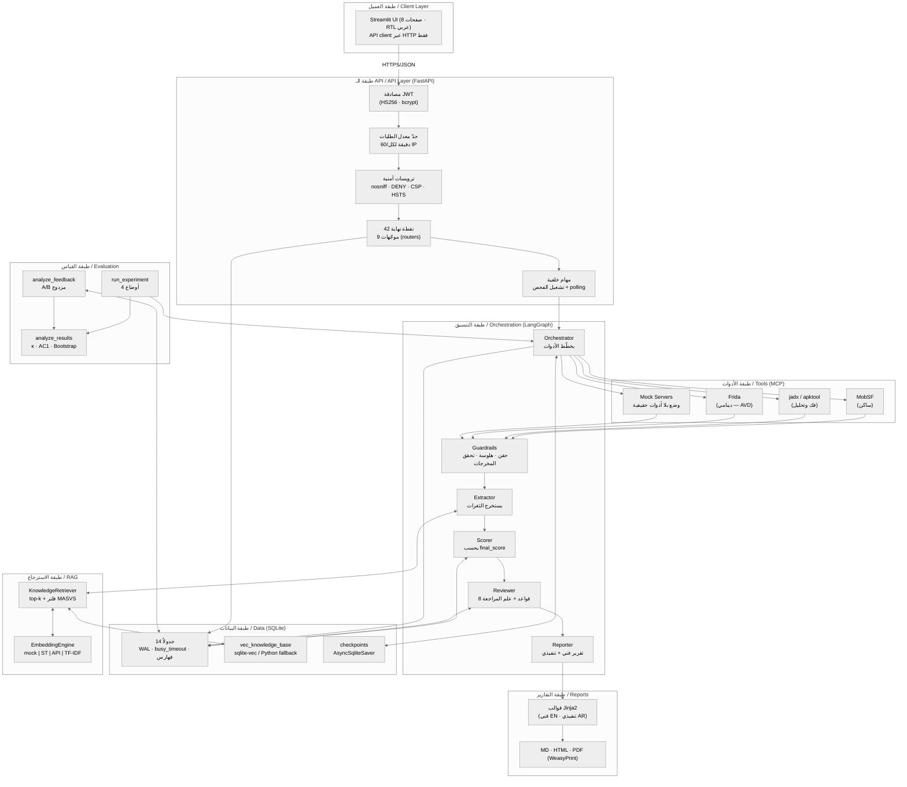

# البنية المعمارية الكاملة

> هذا الملف عرض جاهز للتصيير في VS Code / GitHub / Typora (كتلة mermaid).
> المصدر القابل للتحرير: `architecture.mmd`

```mermaid
%%{init: {'theme':'neutral', 'flowchart': {'curve':'basis'}}}%%
%% =====================================================================
%% الشكل 1 — البنية المعمارية (Architecture)
%% قابل للطباعة بالأبيض والأسود: يعتمد الأشكال والنصوص لا الألوان وحدها.
%% التوليد: python scripts/render_diagrams.py --format svg
%% =====================================================================
flowchart TB
    subgraph CLIENT["طبقة العميل / Client Layer"]
        UI["Streamlit UI (8 صفحات · RTL عربي)<br/>API client عبر HTTP فقط"]
    end

    subgraph API["طبقة الـ API / API Layer (FastAPI)"]
        JWT["مصادقة JWT<br/>(HS256 · bcrypt)"]
        RL["حدّ معدل الطلبات<br/>60/دقيقة لكل IP"]
        HDR["ترويسات أمنية<br/>nosniff · DENY · CSP · HSTS"]
        EP["42 نقطة نهاية<br/>9 موجّهات (routers)"]
        BG["مهام خلفية<br/>تشغيل الفحص + polling"]
    end

    subgraph ORCH["طبقة التنسيق / Orchestration (LangGraph)"]
        ORC["Orchestrator<br/>يخطّط الأدوات"]
        EXT["Extractor<br/>يستخرج الثغرات"]
        SCO["Scorer<br/>يحسب final_score"]
        REV["Reviewer<br/>8 قواعد + علم المراجعة"]
        REP["Reporter<br/>تقرير فني + تنفيذي"]
        GRD["Guardrails<br/>حقن · هلوسة · تحقق المخرجات"]
    end

    subgraph TOOLS["طبقة الأدوات / Tools (MCP)"]
        MOBSF["MobSF<br/>(ساكن)"]
        JADX["jadx / apktool<br/>(فك وتحليل)"]
        FRIDA["Frida<br/>(دينامي — AVD)"]
        MOCK["Mock Servers<br/>وضع بلا أدوات حقيقية"]
    end

    subgraph DATA["طبقة البيانات / Data (SQLite)"]
        DBB["14 جدولاً<br/>WAL · busy_timeout · فهارس"]
        VEC["vec_knowledge_base<br/>sqlite-vec / Python fallback"]
        CKPT["checkpoints<br/>AsyncSqliteSaver"]
    end

    subgraph RAG["طبقة الاسترجاع / RAG"]
        EMB["EmbeddingEngine<br/>mock | ST | API | TF-IDF"]
        RET["KnowledgeRetriever<br/>top-k + فلتر MASVS"]
    end

    subgraph REPORTS["طبقة التقارير / Reports"]
        J2["قوالب Jinja2<br/>(فني EN · تنفيذي AR)"]
        OUT["MD · HTML · PDF (WeasyPrint)"]
    end

    subgraph EVAL["طبقة القياس / Evaluation"]
        EXP["run_experiment<br/>4 أوضاع"]
        ANA["analyze_results<br/>κ · AC1 · Bootstrap"]
        FB["analyze_feedback<br/>A/B مزدوج"]
    end

    UI -->|HTTPS/JSON| JWT
    JWT --> RL --> HDR --> EP
    EP --> BG
    BG --> ORC
    EP --> DBB
    ORC --> MOBSF & JADX & FRIDA & MOCK
    MOBSF & JADX & FRIDA & MOCK --> GRD
    GRD --> EXT --> SCO --> REV --> REP
    EXT <--> RET
    RET <--> EMB
    RET <--> VEC
    SCO <--> DBB
    REV <--> DBB
    REP --> J2 --> OUT
    ORC <--> CKPT
    ORC --> DBB
    EXP --> ORC
    EXP --> ANA
    FB --> ANA
    FB <--> DBB
```
