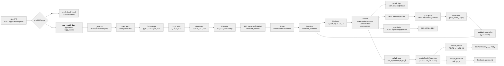

# تدفق البيانات من الرفع إلى التقرير والقياس

> هذا الملف عرض جاهز للتصيير في VS Code / GitHub / Typora (كتلة mermaid).
> المصدر القابل للتحرير: `dataflow.mmd`

```mermaid
%%{init: {'theme':'neutral'}}%%
%% =====================================================================
%% الشكل 2 — تدفق البيانات (Data Flow) من رفع APK إلى التقرير والقياس
%% =====================================================================
flowchart LR
    A["رفع APK<br/>POST /applications/upload"] --> B{"sha256 موجود؟"}
    B -->|نعم| B1["إرجاع السجل القائم<br/>(created=false)"]
    B -->|لا| B2["حفظ الملف + صف applications<br/>+ app_context"]
    B2 --> C["بدء فحص<br/>POST /scans/start (202)"]
    C --> D["مهمة خلفية<br/>BackgroundTask"]
    D --> E["Orchestrator<br/>اختيار الأدوات حسب النوع"]
    E --> F["أدوات MCP<br/>(ساكن/دينامي)"]
    F --> G["Guardrails<br/>كشف حقن + تعقيم"]
    G --> H["Extractor<br/>ثغرات مؤقتة + Dedup"]
    H --> H1["RAG: top-k أنماط MASVS<br/>retrieved_patterns"]
    H1 --> I["Scorer<br/>base+context+evidence"]
    I --> I1["Few-Shot<br/>feedback_examples"]
    I1 --> J["Reviewer<br/>تعديلات القواعد الثمانية"]
    J --> K["Persist<br/>scans.status=success<br/>+ vulnerabilities + assessments"]
    K --> L["انتهاء الفحص<br/>GET /scans/{id}/status"]
    K --> M["HITL: /reviews/pending"]
    M --> N["تصحيح بشري<br/>POST /reviews/{id}/correct"]
    N --> N1["corrections<br/>(final_score لا يُمَس)"]
    N1 --> N2["feedback_examples<br/>(يُغذّي Scorer)"]
    N2 --> I1
    K --> O["توليد التقارير<br/>POST /reports/{id}/generate"]
    O --> P["MD · HTML · PDF"]
    K --> Q["تجربة القياس<br/>run_experiment (4 أوضاع)"]
    Q --> R["results/{mode}/{app}.json<br/>(خام — بلا أرقام مصطنعة)"]
    R --> S["analyze_results<br/>P/R/F1 · κ · AC1 · CI"]
    R --> T["analyze_feedback<br/>A/B مزدوج"]
    S --> U["REPORT.md + رسوم Plotly"]
    T --> V["feedback_ab_test.md"]
```
