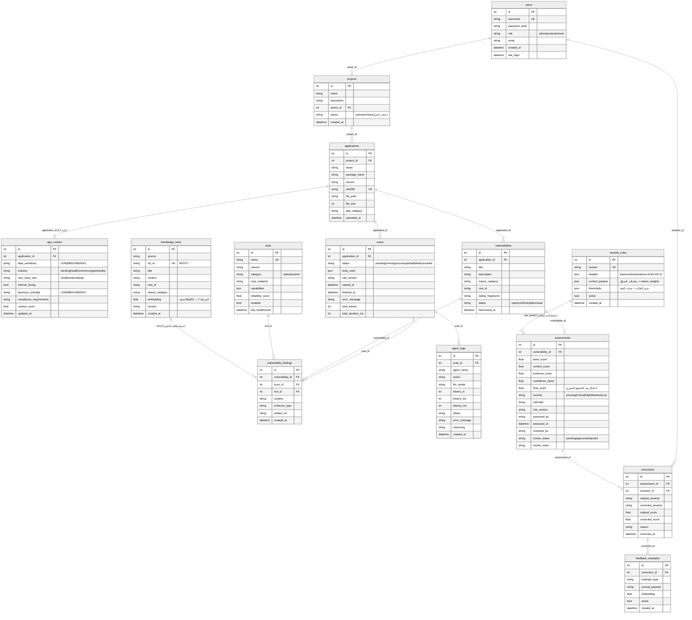

# مخطط قاعدة البيانات (14 جدولاً)

> هذا الملف عرض جاهز للتصيير في VS Code / GitHub / Typora (كتلة mermaid).
> المصدر القابل للتحرير: `db_erd.mmd`

```mermaid
%%{init: {'theme':'neutral'}}%%
%% =====================================================================
%% الشكل 5 — مخطط قاعدة البيانات (ERD) — 14 جدولاً
%% الأعمدة والعلاقات منقولة حرفياً من db/schema.sql (لا حقول مُخترعة)
%% =====================================================================
erDiagram
    users ||--o{ projects : "owner_id"
    users ||--o{ corrections : "reviewer_id"
    projects ||--o{ applications : "project_id"
    applications ||--o| app_context : "application_id (فريد 1:1)"
    applications ||--o{ scans : "application_id"
    applications ||--o{ vulnerabilities : "application_id"
    scans ||--o{ vulnerability_findings : "scan_id"
    scans ||--o{ agent_logs : "scan_id"
    vulnerabilities ||--o{ vulnerability_findings : "vulnerability_id"
    vulnerabilities ||--o| assessments : "vulnerability_id"
    tools ||--o{ vulnerability_findings : "tool_id"
    assessments ||--o{ corrections : "assessment_id"
    corrections ||--o{ feedback_examples : "correction_id"
    severity_rules ||--o{ assessments : "rule_version (مرجع نصي منطقي)"
    knowledge_base ||--o{ vulnerability_findings : "ref_id (مرجع منطقي للتقرير)"

    users {
        int id PK
        string username UK
        string password_hash
        string role "admin|analyst|viewer"
        string email
        datetime created_at
        datetime last_login
    }
    projects {
        int id PK
        string name
        string description
        int owner_id FK
        string status "active|archived (حذف ناعم)"
        datetime created_at
    }
    applications {
        int id PK
        int project_id FK
        string name
        string package_name
        string version
        string sha256 UK
        string file_path
        int file_size
        string app_category
        datetime uploaded_at
    }
    app_context {
        int id PK
        int application_id FK
        string data_sensitivity "LOW|MEDIUM|HIGH"
        string industry "banking|health|commerce|game|utility"
        string user_base_size "small|medium|large"
        bool internet_facing
        string business_criticality "LOW|MEDIUM|HIGH"
        string compliance_requirements
        float context_score
        datetime updated_at
    }
    tools {
        int id PK
        string name UK
        string version
        string category "static|dynamic"
        string mcp_endpoint
        json capabilities
        float reliability_score
        bool enabled
        datetime last_healthcheck
    }
    scans {
        int id PK
        int application_id FK
        string status "pending|running|success|partial|failed|cancelled"
        json tools_used
        string rule_version
        datetime started_at
        datetime finished_at
        string error_message
        int total_tokens
        int total_duration_ms
    }
    vulnerabilities {
        int id PK
        int application_id FK
        string title
        string description
        string masvs_category
        string cwe_id
        string dedup_fingerprint
        string status "open|confirmed|dismissed"
        datetime discovered_at
    }
    vulnerability_findings {
        int id PK
        int vulnerability_id FK
        int scan_id FK
        int tool_id FK
        string location
        string evidence_type
        string artifact_ref
        datetime created_at
    }
    severity_rules {
        int id PK
        string version UK
        json weights "base/context/evidence (0.6/0.2/0.2)"
        json context_params "معاملات السياق + masvs_weights"
        json thresholds "حدود الفئات + عتبات الثقة"
        bool active
        datetime created_at
    }
    assessments {
        int id PK
        int vulnerability_id FK
        float base_score
        float context_score
        float evidence_score
        float confidence_factor
        float final_score "لا يُعدَّل بعد التصحيح البشري"
        string severity "pending|Critical|High|Medium|Low"
        string rationale
        string rule_version
        string assessed_by
        datetime assessed_at
        string reviewed_by
        string review_status "pending|approved|rejected"
        string review_notes
    }
    corrections {
        int id PK
        int assessment_id FK
        int reviewer_id FK
        string original_severity
        string corrected_severity
        float original_score
        float corrected_score
        string reason
        datetime corrected_at
    }
    feedback_examples {
        int id PK
        int correction_id FK
        string example_type
        string prompt_payload
        blob embedding
        bool active
        datetime created_at
    }
    agent_logs {
        int id PK
        int scan_id FK
        string agent_name
        string action
        string llm_model
        int tokens_in
        int tokens_out
        int latency_ms
        string status
        string error_message
        string reasoning
        datetime created_at
    }
    knowledge_base {
        int id PK
        string source
        string ref_id UK "MSTG-*"
        string title
        string content
        string cwe_id
        string masvs_category
        blob embedding "متجه float32 — المرحلة 7"
        string version
        datetime created_at
    }
```
