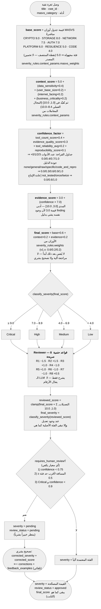

# تدفق حساب الخطورة وقرارات المراجعة

> هذا الملف عرض جاهز للتصيير في VS Code / GitHub / Typora (كتلة mermaid).
> المصدر القابل للتحرير: `scoring_flow.mmd`

```mermaid
%%{init: {'theme':'neutral'}}%%
%% =====================================================================
%% الشكل 4 — تدفق التقييم (Scoring Flow)
%% منقول حرفياً من core/scoring/*.py + agents/reviewer.py + severity_rules
%% آخر مراجعة: الإصدار v1.0 (المرحلة 8) — تصحيح ثلاث مغالطات كانت في نسخة v0.2:
%%   (1) base_score ليس «وزن × 10 مُطبَّعاً إلى [3,9]» بل قيمة الجدول مباشرة
%%   (2) context_score لا يشمل «القطاع» (industry مُخزَّن ولا يدخل المعادلة)
%%   (3) عتبة الحافة ≤ 0.5 (لا < 0.5) والتصحيح البشري لا يمسّ final_score
%% =====================================================================
flowchart TB
    START(["وصل ثغرة نقية<br/>title · cwe_id · masvs_category · أدلة"]) --> BASE

    BASE["<b>base_score</b> = قيمة جدول أوزان MASVS مباشرةً<br/>CRYPTO 9.0 · STORAGE 8.0 · NETWORK 7.5 · AUTH 7.0<br/>PLATFORM 6.0 · RESILIENCE 5.0 · CODE 4.0<br/>فئة مجهولة ⇒ 5.0 (نقطة المنتصف — لا تخمين)<br/>المصدر: severity_rules.context_params.masvs_weights"]
    BASE --> CTX

    CTX["<b>context_score</b> = 5.0 + (data_sensitivity×0.4)<br/>+ (user_base_size×0.2) + (internet_facing×0.2)<br/>+ (business_criticality×0.2)<br/>ثم تُقيَّد في [1.0, 10.0] (المجال العملي 8.4–10.0)<br/>المعاملات من severity_rules.context_params"]
    CTX --> CONF

    CONF["<b>confidence_factor</b> =<br/>tool_count_score×0.4 + evidence_quality_score×0.3<br/>+ tool_reliability_avg×0.2 + reproducibility_score×0.1<br/>جداول القراءة: عدد الأدوات 0/1/2/3+ ⇒ 0.0/0.4/0.7/1.0<br/>جودة الدليل none/general/raw/specific/code_and_repro ⇒ 0.0/0.3/0.6/0.9/1.0<br/>إعادة الإنتاج not_tested/once/twice ⇒ 0.0/0.6/1.0"]
    CONF --> EVID

    EVID["<b>evidence_score</b> = 3.0 + (confidence × 7.0)<br/>المدى [3.0, 10.0] — أدنى قيمة 3.0 لأن وجود finding نفسه يشي بدليل"]
    EVID --> FINAL

    FINAL["<b>final_score</b> = base×0.6 + context×0.2 + evidence×0.2<br/>الأوزان من severity_rules.weights (v1.x: 0.6/0.2/0.2)<br/>لا يُمَس بعد ذلك أبداً — لا مراجعة آلية ولا تصحيح بشري"]
    FINAL --> CLASS

    CLASS{"classify_severity(final_score)"} -->|"≥ 9.0"| C["Critical"]
    CLASS -->|"7.0 – 8.9"| H["High"]
    CLASS -->|"4.0 – 6.9"| M["Medium"]
    CLASS -->|"< 4.0"| L["Low"]

    C & H & M & L --> RULES["<b>Reviewer — 8 قواعد حتمية صريحة</b><br/>R1 −1.5 · R2 +1.5 · R3 +1.0 · R4 −1.0<br/>R5 +1.0 · R6 −1.0 · R7 −1.0 · R8 +0.5<br/>الـ LLM يشرح فقط — لا يعدّل الأرقام"]
    RULES --> REVIEWED["reviewed_score = clamp(final_score + Σ التعديلات, 1.0, 10.0)<br/>final_severity = classify_severity(reviewed_score) عند وجود تعديل<br/>وإلا تبقى الفئة الأصلية كما هي"]
    REVIEWED --> FLAG{"requires_human_review؟<br/>(أي معيار يكفي)<br/>1) confidence &lt; 0.75<br/>2) المسافة لأقرب حد فئة ≤ 0.5<br/>3) Critical و confidence &lt; 0.9"}

    FLAG -->|نعم| PENDING["severity = pending<br/>review_status = pending<br/>(ينتظر خبيراً بشرياً)"]
    FLAG -->|لا| APPROVED["severity = الفئة المعتمدة آلياً"]

    PENDING --> HUMAN(["تصحيح بشري: corrected_severity + corrected_score<br/>⟵ corrections + feedback_examples (تلقائي)"])
    HUMAN --> FS(["severity = القيمة المصحَّحة<br/>review_status = approved<br/>final_score يبقى كما هو (الثابت)"])
    APPROVED --> FS
```
